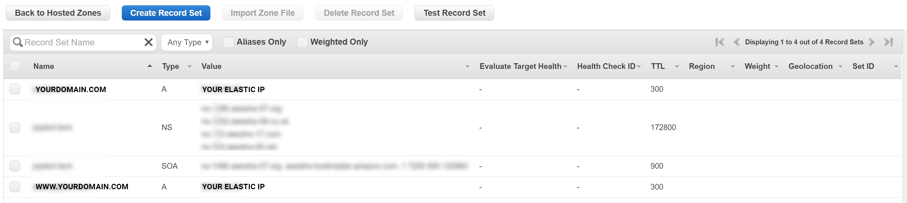

# AWS EC2 HTTPS with NodeJs
*Setup Components*
- Amazon Ec2 instance (NodeJs v6.2.2)
- Domain purchased from Namecheap.com
- Domain Validation Certificate purchased from Comodo  via Namecheap

## Step 1. EC2 setup

  - ### Create Instance
  I've used a `t2.micro` free Linux instance for this example
  Setup your desired configuration and click on `Review and Launch`

  - ### Security Group
  Setup inbound security group settings to allow incoming traffic on http port 80 and https port 443. I've setup 22 for SSH as well.
  

  - ### Elastic IP
    - Assign a static IP address to your domain.
    - Goto `EC2 Dashboard > Network & Security > Elastic IPs`
    - Click on `Allocate a New Address`
    - Select the newly generated static IP. Click on the dropdown `Actions > Associate Address`
  

  - ### SSH into your instance
  For instructions : Go to EC2 Dashboard > Instances > Instances and click on connect in the right section

## Step 2. Setup IP Tables
We need to do this because Nodejs Express Server cannot access port 80/443. We'll setup Express to listen on port 8443 for HTTPS (8000 for HTTP)  and redirect traffic to it.

More info on IP table routing by [Kentbrew](images/https://gist.github.com/kentbrew/776580)
```
# Lookup IP routing tables
sudo iptables -t nat -L

# Add HTTP port 80 and 443 traffic redirect rule
sudo iptables -t nat -A PREROUTING -p tcp --dport 80 -j REDIRECT --to-ports 8000
sudo iptables -t nat -A PREROUTING -p tcp --dport 443 -j REDIRECT --to-ports 8443

# If you f**k up. Use following to, say delete the first entry
sudo iptables -t nat -D PREROUTING 1
```

## Step 3. Generate private key and CSR

Go to your Nodejs project folder and generate a new private key and Certificate Sigining Request

`openssl req -out CSR.csr -new -newkey rsa:2048 -nodes -keyout privateKey.key`

It'll create two files :

- CSR.csr : Certificate Signing Request file
- privateKey.key : Your private key file

## Step 4. Domain Routing

### Domain Purchase
Purchase a domain from `Namecheap.com`

### Nameservers Setup
- Go to `Route 53` through AWS Console
- Go to `Hosted Zones` in left panel
- Create a hosted zone. Give it the same domain name as the one you purchased.
- Go to the newly created hosted zone and `Create Record Set`
- Create two A records. `www.yourdomain.com` & `yourdomain.com` with value of `Elastic IP that you created`



- Copy the value of the `NS Type` records. Go to Namecheap and `Manage` your domain.
- Choose `Custom DNS` under Nameservers dropdown. Paste the copied Nameservers from AWS here.


### Purchase Certificate
This document shows you the steps for Domain Validation (DV) Certificate.

- From Namecheap menu go to `Security > SSL Certificate`. Make your purchase for DV Certificate.
- Add it to the domain you purchased.
- In you Namecheap dashboard you'll notice that the activation is pending.


## Step 5. Certificate Activation

- We'll follow steps for HTTP activation method.
- Download the certificate `.txt` from `Namecheap Dashboard > SSL (icon) > Manage`
- Click on `see details > download`
- Place it in `/public` directory for node server

SSH into your Nodejs project folder on EC2
`npm install --save express http https fs`

Obtain SSL Certificate from `Comodo`.
Create `app.js` in your AWS project folder
```
// DCV Domain Control Validation
var app = require('express')();
var http = require('http').Server(app);
app.use(require('express').static('public'));
app.get('/', function(req, res) { // Change to options Bot vs user
   res.writeHead(200);
   res.end("DCV validation using HTTP\n");
});
http.listen(8000, function() {
 console.log('Express listening on *:8000');
});
```

Wait, refresh or take a break.
After a while you'll see the certificate status change from 'In Progress' to 'Issued'


Download the certificate files. You may receive them over email or directly download from SSL section in Namecheap.

## Step 6. Start the Node Server
Paste the zip contents in your NodeJs project root folder.
Now you are all set to start your HTTPS Server.

Change your `app.js` script to:
```
var https = require('https');
var fs = require('fs');
var https_options = {
 ca: fs.readFileSync("yourdomain.ca-bundle"),
 key: fs.readFileSync("privateKey.key"),
 cert: fs.readFileSync("yourdomain.crt")
};
https.createServer(https_options, function (req, res) {
 res.writeHead(200);
 res.end("Welcome to Node.js HTTPS Server");
}).listen(8443)
```
- Run `node app.js`
- Now open your browser and go to your domain
- If everything was setup correctly you'll see green https in your browser address bar. Phew.

---

### Folder Structure
```
Node Project
│   app.js
│   privateKey.key        // Generated by Openssl
│   yourdomain.ca-bundle  // Zip file from Comodo
│   yourdomain.crt        // Zip file from Comodo
│   yourdomain.p7b        // Zip file from Comodo
│
└───public
        http-Validation-Text-File.txt // From Comodo
```
